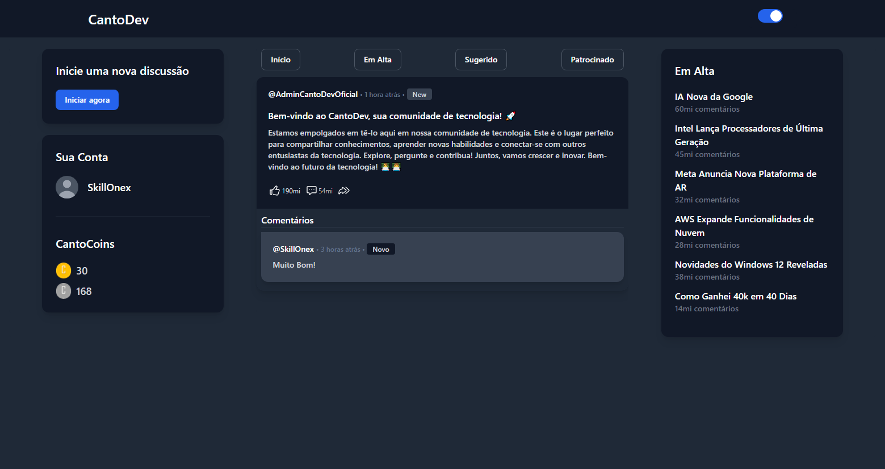
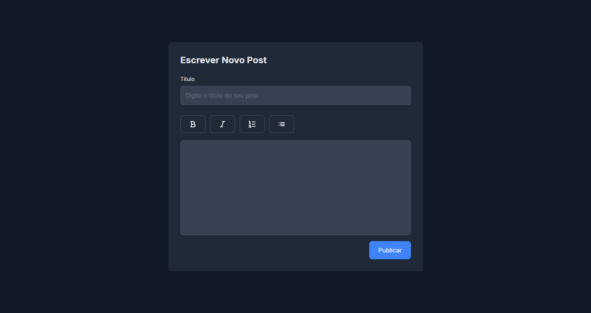

   
   
   


# CantoDev

**CantoDev** é uma comunidade voltada para a área de tecnologia, criada para oferecer um espaço simples, otimizado, bonito e responsivo onde os usuários podem postar dúvidas, artigos e muito mais. Utilizando Node.js e Tailwind, este projeto visa promover a colaboração e o aprendizado entre entusiastas da tecnologia.

## Funcionalidades

- **Postagem de Conteúdo:** Usuários podem criar posts com dúvidas, artigos, e outros conteúdos técnicos.
- **Sistema de Moedas:** Cada post permite aos usuários ganhar moedas, que podem ser trocadas por posts patrocinados em destaque.
- **Gamificação:** Moedas podem ser ganhas ajudando outros membros da comunidade e podem ser perdidas se um post for mal avaliado ou se o usuário receber muitos reports.
- **Responsividade e Design Atraente:** Utiliza Tailwind para garantir um design moderno e responsivo.

## Tecnologias Utilizadas

- **Node.js:** Para o backend e lógica do servidor.
- **Tailwind CSS:** Para estilização e design responsivo.
- **Futuras Integrações:** Planeja-se integrar IA para moderar e responder aos posts na comunidade , Chat entre Usuários , exibição de perfil público , Aba para carreiras e outros.

## Imagem do Projeto
- Não vou incluir mais imagens para não poluir o Readme
<div align="center">



</div>

## Instalação

1. Clone este repositório:
   ```bash
   git clone https://github.com/SkillOnex/CantoDev.git
   ```
2. Navegue até o diretório do projeto:
   ```bash
   cd CantoDev
   ```
3. Instale as dependências:
   ```bash
   npm install
   ```
4. Configure as variáveis de ambiente:
   - Crie um arquivo `.env` na raiz do projeto e adicione suas variáveis de ambiente necessárias 
   ```
    PORT=
    COOKIE_SECRET=
    DB_HOST=
    DB_USER=
    DB_PASSWORD=
    DB_NAME=
    DB_PORT=
   ```

5. Inicie o servidor:
   ```bash
   npm start
   ```

## Contribuindo

1. Faça um fork deste repositório.
2. Crie uma branch para suas mudanças:
   ```bash
   git checkout -b minha-mudanca
   ```
3. Faça as mudanças e adicione os arquivos modificados:
   ```bash
   git add .
   ```
4. Faça um commit com uma mensagem clara:
   ```bash
   git commit -m "Descrição das mudanças"
   ```
5. Envie suas mudanças para o repositório remoto:
   ```bash
   git push origin minha-mudanca
   ```
6. Abra um Pull Request no GitHub.

## Link para Mais Informações

Discord : skillonex

